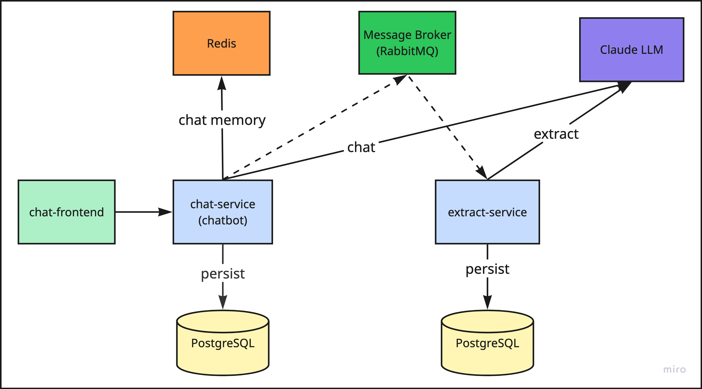

# Apate AI

Apate AI is a scam-detection chatbot that plays along with a scammer's conversation to collect intelligence — bank account details, email addresses, phone numbers, and PayIDs.

---



---

## chat-frontend

- Next.js, App Router — very similar to `../architect-multi-agent/frontend`
- Expandable left menu: **New Chat** button, **Chat History**
  - **New Chat** button → new chat page with a chat interface. Sends a request to chat-service at `api/chat/`, then opens a WebSocket to `api/chat/{uuid}`
  - **Chat History** → lists chat history. Requests `GET api/chat/history` and `GET api/chat/history/{uuid}` for the detail of each conversation

---

## chat-service

NestJS, TypeORM — very similar to `../architect-multi-agent/backend`

### Interfaces

```typescript
interface Message {
  sender: "user" | "agent";
  text: string;
  timestamp: date;
}

interface Conversation {
  conversationId: uuid;
  messages: Message[];
  scamProbability: number;
  status: StatusEnum;
  createdAt: date;
  modifiedAt: date;
}

enum StatusEnum {
  Inprogress = 0,
  Ended = 1,
}

interface ChatMessage {
  conversationId: uuid;
  text: string;
}

interface ChatEnd {
  conversationId: uuid;
}

interface ChatResponse {
  conversationId: uuid;
  text: string;
  scamProbability: float; // 0-1
}

interface ConversationEvent {
  eventName: "apate.conversation.ended";
  data: {
    conversationId: uuid;
    messages: Message[];
    scamProbability: number;
    status: StatusEnum;
    createdAt: date;
    modifiedAt: date;
  };
}
```

### Database

```typescript
table conversations {
  id: int, auto-increment;
  uuid: string;
  title: string;
  messages: Message[]; // jsonb
  scam_probability: float; // 0-1
  status: StatusEnum; // smallint
  created_at: date;
  modified_at: date;
}
```

### Endpoints

| Method | Path | Description |
|--------|------|--------------|
| `POST` | `api/chat/` | Create a new record in the `conversations` table, with `title` set to a substring of the message, and store an item in Redis with key `uuid` and value `Conversation`. |
| `POST` | `api/chat/{uuid}` | The frontend sends a `ChatMessage`. chat-service converts it to a `Message` (`sender="user"`, timestamp added), appends the new `Message` to `Conversation.messages` in Redis, then sends the full conversation to Claude. Claude responds with a `ChatResponse`, chat-service appends a new `Message` (`sender="agent"`) to `Conversation.messages`, and updates `Conversation.scamProbability`. |
| `POST` | `api/chat/{uuid}/end` | On the frontend, when the user closes or navigates away from the current conversation's chat page, the frontend sends a `ChatEnd` request to this endpoint. chat-service retrieves the `Conversation` from Redis and upserts the record in the `conversations` table. An env var `EXTRACT_ACTION=1\|2` (`SYNC`\|`ASYNC`) controls the handoff: if `EXTRACT_ACTION=1`, send a request to extract-service at `api/extract` with payload `Conversation`; if `EXTRACT_ACTION=2`, publish a `ConversationEvent` message to exchange `apate` with routing key `apate.conversation.ended`. |
| `GET` | `api/chat/` | Return the list of conversations. |
| `GET` | `api/chat/{uuid}` | Return the detail of one conversation. |

---

## extract-service

NestJS, TypeORM — use `../architect-multi-agent/backend` for style and pattern.

### Interfaces

```typescript
enum ExtractDataTypeEnum {
  NAME = "name",
  EMAIL = "email",
  PHONE = "phone",
  ADDRESS = "address",
  BANK_ACCOUNT_AU = "bank_account_au",
  BANK_ACCOUNT_UK = "bank_account_uk",
  PAYID = "pay_id",
}

interface ExtractOutput {
  conversations: ExtractConversation[];
}

interface ExtractConversation {
  conversationUuid: string;
  items: ExtractItem[];
}

interface ExtractItem {
  dataType: ExtractDataTypeEnum;
  value: string;
}
```

**Format validation:**

| `dataType` | Format |
|---|---|
| `BANK_ACCOUNT_AU` | BSB (`NNN-NNN`) + account (`NNNNNNNN`) |
| `BANK_ACCOUNT_UK` | sort code (`NN-NN-NN`) + account (`NNNNNNNN`) |
| `PAYID` | email / phone / ABN |

### Database

```typescript
enum ExtractStatusEnum {
  NEW = 0,
  PROCESSED = 1,
  PROCESSING = 2,
}

table conversations {
  id: int, auto-increment;
  uuid: string;
  title: string;
  messages: Message[]; // jsonb
  scam_probability: float; // 0-1
  status: ExtractStatusEnum; // smallint
  created_at: date;
  modified_at: date;
}

table extractions {
  id: int, auto-increment;
  conversation_uuid: string;
  data_type: ExtractDataTypeEnum | string;
  value: string;
  created_at: date;
  unique index: (conversation_uuid, data_type, value);
}
```

> **Note:** chat-service and extract-service use the same PostgreSQL instance, in different schemas (`chat_service`, `extract_service`).

### Endpoints

| Method | Path | Description |
|--------|------|--------------|
| `POST` | `api/extract` | Payload: `Conversation`. extract-service feeds a list of conversations (one item each) to Claude to extract intelligence. The system prompt includes instructions for every `ExtractDataTypeEnum` value. For each conversation, Claude responds with structured output `ExtractOutput`; extract-service then processes the output and upserts into the `extractions` table (see unique index `(conversation_uuid, data_type, value)`). |

### RabbitMQ Consumer

- Refer to `../code-inspect/checkout-service` for the pattern and implementation of `EventModule`.
- The RabbitMQ consumer subscribes to the `apate` exchange for routing key `apate.conversation.ended`, extracts the `Conversation` data from the event payload, and upserts it into the `conversations` table (by `uuid`).

### Cron task

Implement a cron task that runs every minute:

1. Fetch all conversations with `status = ExtractStatusEnum.NEW`.
2. Send them to Claude to extract intelligence.
3. While processing, set `conversation.status = ExtractStatusEnum.PROCESSING` so other instances don't pick them up again.
4. On receiving the response from the LLM, set `conversation.status = ExtractStatusEnum.PROCESSED`.
